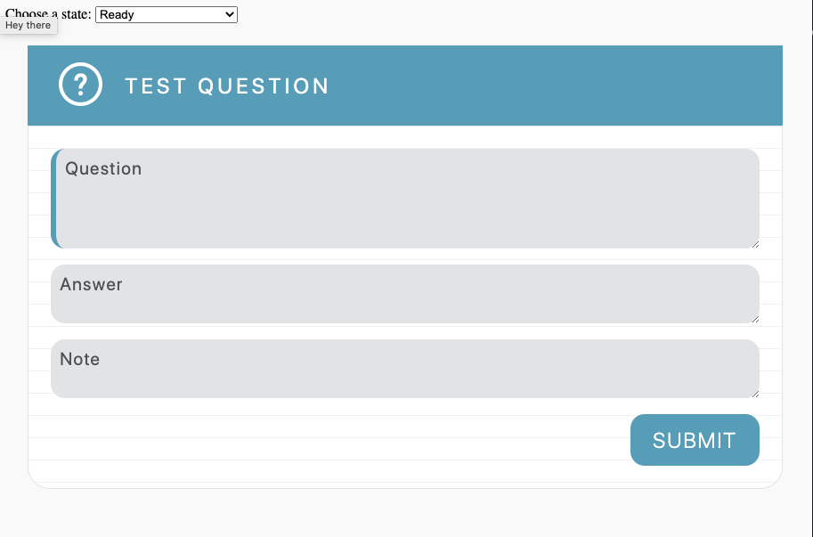
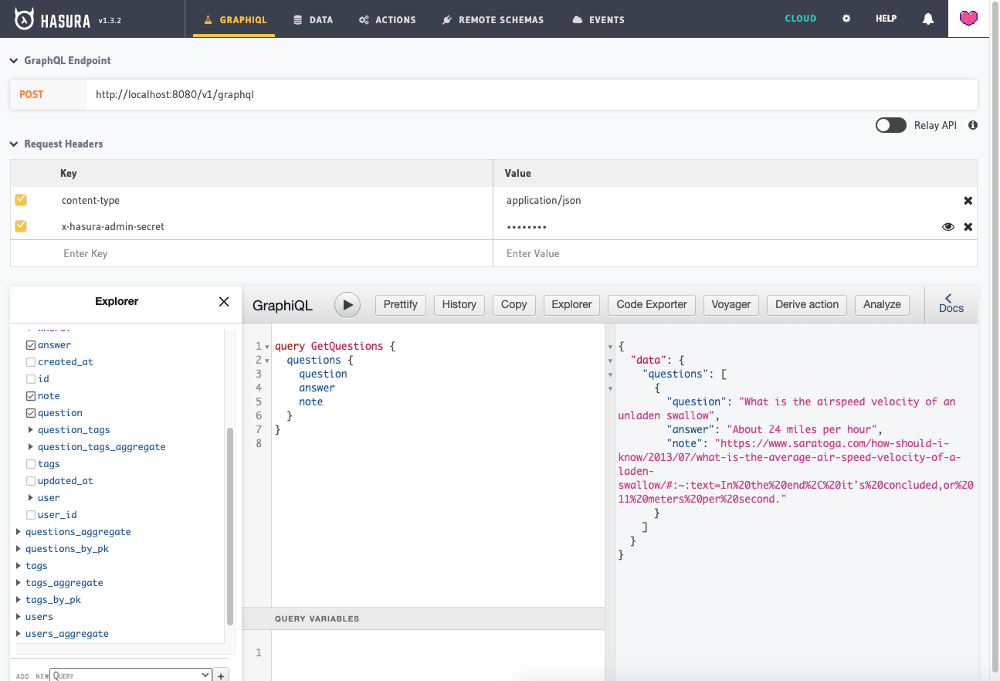

# Practice Questions Service




## Getting Started

Run the Backend

```
make start-dev
```

Visit the Hasura Console http://localhost:8080

Run the Frontend

```
cd components/practice-question
yarn install
yarn start
```

Visit the practice-question web component demo http://localhost:8001/demo/


## Developing in Hasura

Install the [Hasura CLI](https://hasura.io/docs/1.0/graphql/core/hasura-cli/index.html) locally. This unfortunitely needs to be installed locally until [this issue is resolved](https://github.com/hasura/graphql-engine/pull/3570)

Any time we are making changes to the Hasura backend structure (i.e. the database layer)
we need to run Hasura in Console mode.  This will track all changes in our local file system.

Run the console

```
make start-dev
```

A browser window will automatically pop up.  Any changes made in that browser session will be tracked as migration changes in your local file system.

### Applying Hasura Changes

```
cd hasura
hasura migrate apply --admin-secret password
hasura seeds apply --admin-secret password
```


## Web Components

Install the web component dependencies

```
cd components/practice-question
npm install
npm start
```

Visit http://localhost:8000/demo/

